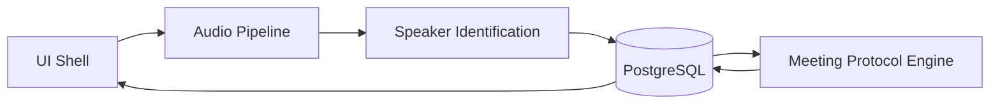

# AYE Hear System Boundaries

## Purpose

This document defines the runtime and ownership boundaries between the core AYE Hear subsystems.

## Subsystems

### 1. UI Shell

Responsibilities:
- start and stop meeting workflows
- expose enrollment, live transcript, manual correction and protocol review
- present confidence and error state to the user

Does not own:
- raw audio processing
- speaker embedding inference
- direct protocol extraction logic

### 2. Audio Pipeline

Responsibilities:
- capture microphone input through the approved Windows path
- apply preprocessing and chunking
- feed transcription and diarization stages with normalized audio segments

Does not own:
- participant identity decisions
- persistent protocol generation

### 3. Speaker Identification

Responsibilities:
- manage speaker enrollment
- generate and compare speaker embeddings
- assign confidence-scored speaker matches to transcript segments
- trigger manual review when the confidence threshold is not met

Does not own:
- microphone capture
- protocol drafting

### 4. Meeting Protocol Engine

Responsibilities:
- consume reviewed transcript state
- generate structured protocol revisions locally
- emit protocol snapshots and action items

Does not own:
- raw capture
- direct UI orchestration
- final speaker identity decisions before correction

## Communication Pattern

- UI Shell coordinates the user workflow
- Audio Pipeline emits segment-ready outputs to Speaker Identification and transcription handling
- Speaker Identification writes speaker-attributed transcript state into the canonical persistence layer
- Meeting Protocol Engine reads reviewed transcript state and writes immutable protocol snapshots

## Data Ownership

- UI Shell owns interaction state only
- Audio Pipeline owns transient capture buffers only
- Speaker Identification owns enrollment and attribution decisions before and during review
- Meeting Protocol Engine owns draft extraction logic and protocol snapshot production
- PostgreSQL remains the shared system-of-record, not a separate subsystem owner

## Error and Fallback Rules

- If audio capture degrades, transcript persistence stops at the last valid segment and the UI must surface the interruption
- If speaker confidence is too low, the transcript segment remains reviewable and must not be silently finalized
- If protocol extraction fails, transcript review continues and protocol generation can be retried from persisted transcript state
- If accelerated hardware fails, runtime falls back to CPU-only mode

## Threading and Execution Boundaries

- UI operations stay on the UI thread
- audio capture and preprocessing run off the UI thread
- transcription, diarization and protocol generation run in background workers or services
- persistence calls must not block the UI event loop for long-running work

## Component View

## Testing Implications

- UI tests validate workflow and review interactions
- audio tests validate capture and preprocessing boundaries
- speaker tests validate confidence scoring, enrollment and correction behavior
- protocol tests validate snapshot generation from persisted transcript state

## Related ADRs

- ADR-0003: Speaker Identification & Diarization Pipeline
- ADR-0004: Audio Capture & Preprocessing (WASAPI)
- ADR-0005: Meeting Protocol Engine & LLM
- ADR-0007: Persistence Contract and Lifecycle